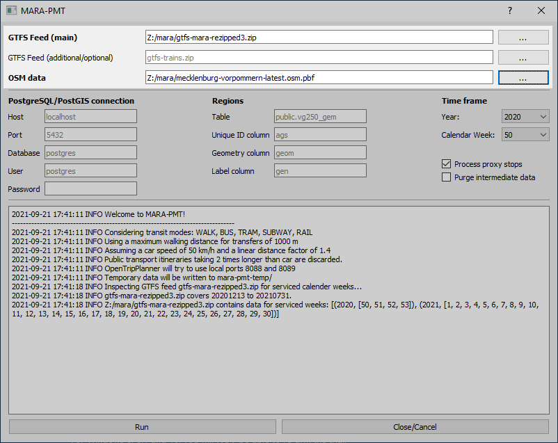
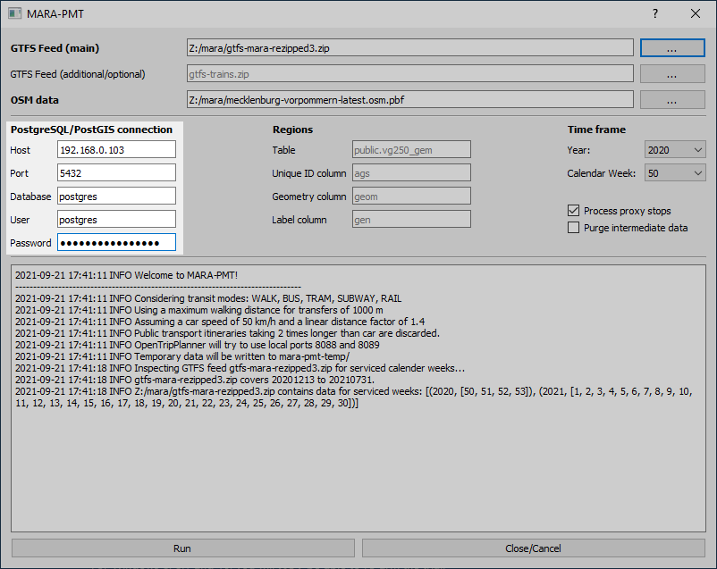
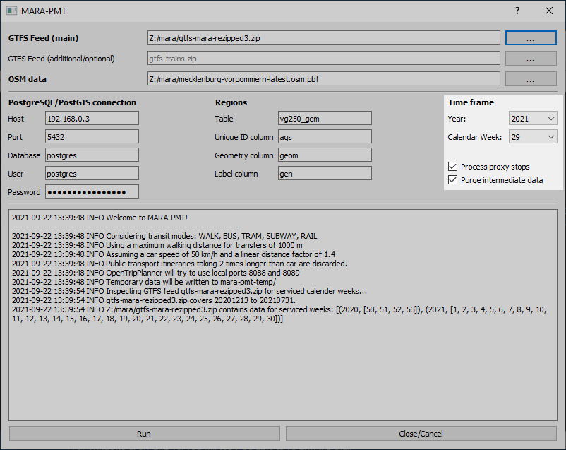

# Anwenderdokumentation MARA PTM Importer

## Systemvoraussetzungen
### Auf dem Anwendersystem
- Windows, vermutlich 7+
- Java 11+, z. B. die "JRE" von https://adoptopenjdk.net/releases.html
- 6-8 GB freier Arbeitsspeicher
- Einige GB freier Speicherplatz, möglichst auf einer schnellen SSD
- Ein Prozessor mit mehreren, schnellen Kernen/Threads (ein Ryzen 3600 6 Kernen / 12 Threads oder äquivalentes System ist angemessen)
### Auf dem PostgreSQL/PostGIS-Server
- PostgreSQL 12/13 oder neuer
- PostGIS 3 oder neuer
- 200 GB freier Speicherplatz auf einer schnellen SSD
- Mehrere GB freier Arbeitsspeicher
- Mehrere CPU-Kerne/Threads

## Datenvoraussetzungen
### Auf dem Anwendersystem
- Eine GTFS-Datei der auszuwertenden Fahrplandaten
- Eine [OpenStreetMap-Datei der betreffenden Region im OSM-PBF-Format](https://download.geofabrik.de/europe/germany.html). Wählen Sie die kleinstmögliche Abdeckung aus, um die Berechnungen nicht unnötig zu verlangsamen.
### Auf dem PostgreSQL/PostGIS-Server
- Geographische Daten der zu betrachtenden Regionen, z. B. Verwaltungsgebiete
    - Die Daten müssen als PostGIS-Geometrien in keinem bestimmten, aber in einem validen, Projektionssystem vorliegen
    - Die Daten müssen eindeutige Identifikatoren haben
        - Falls der [VG250_GEM-Datensatz des BKG](https://gdz.bkg.bund.de/index.php/default/solr/search/index/?q=VG250_GEM+) verwendet mit der `AGS`-Spalte wird, so dürfen daher nur Fläche mit dem Attribut `gf=4` in der Tabelle vorliegen
    - Die Tabelle darf nicht `regions` heißen
- Bewegungsdaten in stündlichen Zeitscheiben in einer Tabelle namens `mobility_hourly` mit folgendem Schema:
    - `origin` und `destination` referenzieren dieselben IDs wie die Regionen-Tabelle
    - `wday` ist 0..6 für den Wochentag (Montag-Sonntag), - `origin_time` ist die Stunde, in welcher Bewegungen gestartet sind, in lokaler Zeit ("Europe/Berlin")
    - `count` ist die Anzahl Bewegungen in der Zeitscheibe
### Spezielles
Im Rahmen der MARA-Fallstudie werden für überregionale Ziele "Proxy"-Haltestellen in den Betrachtungsregionen genutzt, von denen Fahrten zu den überregionalen Zielen getätigt werden können. Diese sind in `queries/create_proxy_stops.sql` definiert und mit weiteren dynamischen Regeln `queries/create_table_itinerary_stop_times_to_nonregional.sql` verfeinert und sind bei einem anderen Untersuchungsgebiet anzupassen, sofern sie verwendet werden sollen.

# Schritt für Schritt
Starten Sie das Interface mit einem Doppelklick auf MARA-PTM-Importer.exe. Ein Kommandozeilenfenster erscheint (dieses können Sie ignorieren, es dient zur Fehlersuche im Fall der Fälle) und etwas später die Oberfläche:

_Achten Sie im Folgenden stets auf die Ausgabe von hilfreichen Fehlermeldungen. Ihre Bedeutung und mögliche Lösungsansätze sind weiter unten erläutert._

Wählen Sie die GTFS-Datei mit den Fahrplandaten aus. Anschließend zeigt das Protokoll den durch die Datei abgedeckten Zeitraum. Hier im Beispielbild 2020-KW50 bis 2021-KW30.

Wählen Sie gegebenenfalls eine zusätzliche GTFS-Datei, um weitere Fahrplandaten hinzuzufügen.

Wählen Sie eine Datei mit OpenStreetMap-Daten für die Untersuchungsregion.

_Achtung: Wenn Sie eine falsche Datei für "OSM data" auswählen, kann es passieren, dass ausschließlich ÖV-Verbindungen ohne Umstiege gezählt werden. Hierzu erscheint keine Fehlermeldung! Die "OSM Data"-Datei muss im OSM-PBF-Format vorliegen und die Dateiendung .osm.pbf haben!_

Geben Sie die Verbindungsdetails zum PostgreSQL/PostGIS-Server an.

Geben Sie die Details der Tabelle mit den Untersuchungsregionen an. Als "Label column" können Sie eine Spalte wählen, welche später z. B. für Beschriftungen in Karten dienen soll.

Wählen Sie den zu untersuchenden Zeitraum aus, zunächst das Jahr, dann die Kalenderwoche.

Wählen Sie aus, welche maximale Fahrtzeit eine ÖV-Verbindung im Vergleich mit einer PKW-Fahrt haben darf, in dem Sie einen entsprechenden Faktor unter "PT/Car time threshold" angeben (das entsprechende Element wurde nachträglich hinzugefügt und ist nicht in den Screenshots sichtbar). Ein Wert von 2 hieße, dass ÖV-Verbindungen, die mehr als die zweifache Reisezeit bedeuten würden, frühzeitig herausgefiltert und nicht mitberechnet würden.

Wählen Sie, ob überregionale Ziele über "Proxy-"Haltestellen erreicht werden können, indem Sie das entsprechende Häkchen setzen.

Wählen Sie, ob zwischenzeitlich auf dem Datenbankserver erzeugte Daten nach dem erfolgreichen Berechnen der Werte gelöscht werden sollen, indem Sie das entsprechende Häkchen setzen. Werden diese nicht gelöscht, kann es gegebenenfalls bei einer Fehlersuche helfen. Andernfalls gibt es keine Grund sie nicht zu löschen, es werden viele Gigabyte an Speicherplatz auf dem Server freigegeben.

Klicken Sie auf "Run", wenn Sie den Prozess starten möchten. Je nach Umfang und Komplexität der Daten und je nach verwendeter Hardware kann es Stunden bis Tage dauern, bis er erfolgreich beendet ist. Eine weitere Betreuung des Interface ist bis dahin nicht nötig.

Nach einer Weile wird die Meldung "INFO ##### Collecting itineraries..." angezeigt und das System komplett ausgelastet. In diesem, dem längsten Arbeitsschritt, wird alle 5 Minuten eine Fortschrittsanzeige ausgegeben, welche die Anzahl der bisher gesammelten Verbindungsmöglichkeiten angibt.

Für die Rufbusdaten des LVP vom Juli 2021 und die KW 2021-29 ist das Ende ungefähr bei 3,5 Millionen dieser "itineraries" erreicht. Anschließend erfolgt die Auswertung der Daten und die Erzeugung der Ausgabewerte.

Erscheint die Meldung "\*\*\*\*\* All done! You can now close this tool. *\*\*\*\*" so ist die Datenaufbereitung erfolgreich beendet worden. Die Daten liegen nun auf dem Server vor und können z. B. in einer Webanwendung genutzt werden.

# Fehlerbehebung
Das Interface zeigt bei Fehlern detaillierte Fehlermeldungen an. Im Folgenden werden diese vorgestellt und mögliche Ansätze zur Behebung empfohlen.

## 'psycopg2.OperationalError: ERROR could not connect to server: Connection refused'
Der PostgreSQL/PostGIS-Server ist nicht erreichbar.
- Sind die Verbindungsdaten korrekt?
- Läuft der Server?
- Ist Port 5432/TCP des Servers offen?
- Blockiert eine Firewall auf dem Anwendersystem die Verbindung?

## 'psycopg2.OperationalError: FATAL:  database "postgres1" does not exist'
Die für die PostgreSQL-Verbindung angegebene Datenbank ist falsch.

## 'psycopg2.OperationalError: FATAL:  role "postgres1" does not exist'
Der für die PostgreSQL-Verbindung angegebene Benutzername ist falsch.

## 'psycopg2.errors.UndefinedTable: relation "example" does not exist'
Die Tabelle "example" wurde nicht in der Datenbank gefunden. Vermutlich wurde als "Regions"-Tabelle ein falscher Tabellenname angegeben.

## 'psycopg2.errors.UndefinedColumn: column "example" does not exist'
Die Spalte "example" wurde nicht in der Tabelle gefunden. Vermutlich wurde für die "Regions"-Tabelle ein falscher Spaltenname angegeben.

## 'psycopg2.errors.DiskFull: could not write to file "base/pgsql_tmp/pgsql_tmp1234567.89": No space left on device
Der Speicherplatz auf dem Datenbankserver war nicht ausreichend. Verdoppeln Sie im Zweifel den Speicherplatz des Servers.

## 'CRITICAL Malformed GTFS feed Z:/pfad/dateiname!'
Die ausgewählte GTFS-Datei ist nicht valide.

- Ist es eine ZIP-Datei mit "gtfs" im Dateinamen?
- Liegen die Dateien im ZIP direkt im Wurzelverzeichnis oder (fälschlicherweise) in einem Unterverzeichnis?
- Liegen die vom GTFS-Standard geforderten Dateien im ZIP?

## 'Service times of the additional GTFS feed do not include the selected week!'
Die als zusätzliche Datengrundlage angebenene GTFS-Datei enthält keine Daten im Zeitraum der primären GTFS-Datei.

## 'FileNotFoundError: [Errno 2] No such file or directory: ".\\queries\\example.sql"'
Die Datenbankabfragen des Interface wurden nicht korrekt installiert. Bitte stellen Sie sicher, dass das Installationsarchiv einwandfrei entpackt wurde.

## 'Java is not available!'
Es wurde keine funktionierende Java-Installation auf dem Anwendersystem gefunden.

## 'Java works but OTP (otp-2.0.0-shaded.jar) is not available or broken! Make sure it is available in the same directory as this tool.'
Die JAR-Datei des OpenTripPlanner wurde nicht gefunden. Liegt die "otp-2.0.0-shaded.jar"-Datei im selben Verzeichnis wie die .exe-Datei?

## OpenTripPlanner startet nicht erfolgreich
Sollte das Starten des OpenTripPlanners den PC nicht auslasten (Lüftergeräusch bzw. Aktivität im Task Manager) und nach 10-15 Minuten nicht fertig sein ("Still waiting for OpenTripPlanner (PID: 123456)..."-Meldungen ohne Ende), dann hat vermutlich beim Start desselben etwas nicht funktioniert.

- Ist die OpenStreetMap-PBF-Datei intakt?
- Hat(te) das System keinen freien RAM mehr?
- Hat(te) das System keinen freien festplattenspeicherplatz mehr?
- Sind die Ports 8088 und 8089 auf dem System schon in Verwendung?

Zur Fehlersuche hilft es in das Kommandozeilenfenster zu schauen, dort werden Statusmeldungen des OpenTripPlanners angezeigt.

## Das System stürzt komplett ab
Da der Prozess sehr rechenintensiv ist und den Prozessor komplett auslastet, kann es zu starker Wärmeentwicklung kommen. Achten Sie bitte, dass die existierende Kühlung des Systems angemessen und ausreichend ist.

