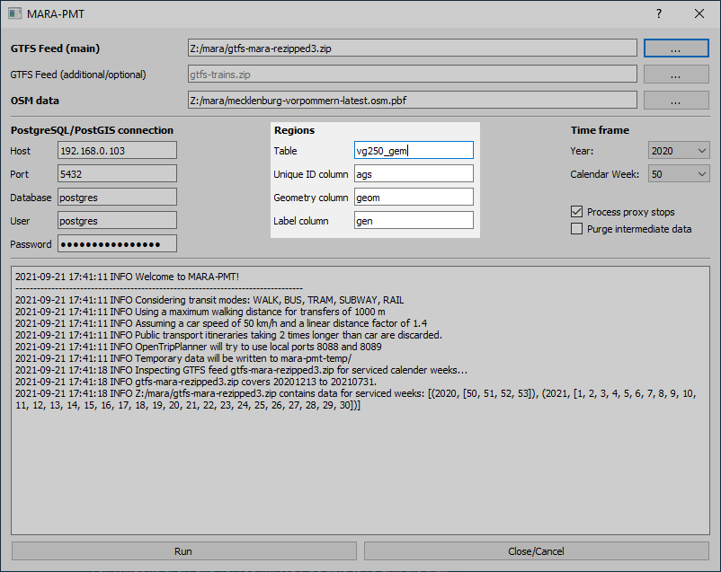
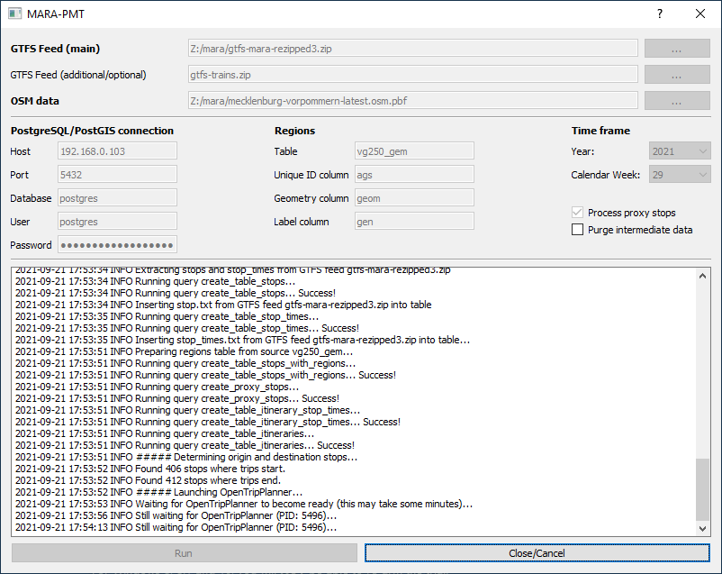
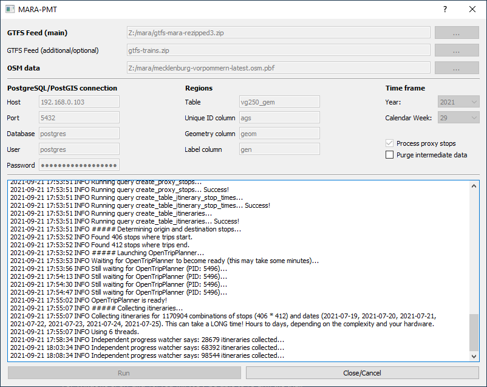

# PTM Tool (Public Transport vs. Mobility Tool)

# User documentation for the MARA PTM Importer

## System requirements
### On the user system
- Windows, probably 7+
- Java 11+, e.g. the "JRE" from https://adoptopenjdk.net/releases.html
- 6-8 GB free RAM
- A few GB of free memory, preferably on a fast SSD
- A processor with multiple, fast cores/threads (a Ryzen 3600 6 cores / 12 threads or equivalent is appropriate)

### On the PostgreSQL/PostGIS server
- PostgreSQL 12/13 or newer
- PostGIS 3 or newer
- 200 GB free disk space on a fast SSD
- Several GB of free RAM
- Multiple CPU cores/threads

## Data requirements
### On the user system
- A GTFS file of the timetable data that shall be evaluated.
- An [OpenStreetMap file of the region in question in OSM-PBF format](https://download.geofabrik.de/europe/germany.html). Select the smallest possible coverage to avoid slowing down the calculations unnecessarily.

### On the PostgreSQL/PostGIS server
- Geographical data of the regions to be considered, e.g. administrative areas.
    - The data must be available as PostGIS geometries in no specific, but in a valid, projection system.
    - The data must have unique identifiers
        - If the [VG250_GEM dataset of the BKG](https://gdz.bkg.bund.de/index.php/default/solr/search/index/?q=VG250_GEM+) is used with the AGS column, only areas with the attribute `gf=4` may be present in the table.
    - The table must not be called `regions`
- Movement data in hourly time slices in a table called `mobility_hourly` with the following schema:
    - `origin` and `destination` reference the same IDs as the regions table.
    - `wday` is 0..6 for the day of the week (Monday-Sunday),
    - `origin_time` is the
    hour in which movements started, in local time ("Europe/Berlin")
    - `count` is the number of movements in the time slice

### Special
In the context of the MARA case study, "proxy" stops in the regions under consideration are used for supraregional destinations, from which journeys can be made to the supraregional destinations. These are defined in `queries/create_proxy_stops.sql` and refined with further dynamic rules `queries/create_table_itinerary_stop_times_to_nonregional.sql` and are to be adapted for a different study area if they are to be used.

# Step by step
Start the interface by double-clicking on MARA-PTM-Importer.exe. A command line
window appears (you can ignore this, it is for troubleshooting in case of errors) and a
little later the interface:

_In the whole process, always pay attention to the output of helpful error messages. Their meaning and possible solutions are explained below._

Select the GTFS file with the timetable data. The log then shows the period covered by the file. Here in the example it shows calender week 50 in 2020 to calendar week 30 in 2021.

If necessary, select an additional GTFS file to add further timetable data.

Select a file with OpenStreetMap data for the study region.

_Caution: If you select an incorrect file for "OSM data", it may happen that only public transport connections without transfers are counted. No error message will appear for this! The "OSM data" file must be in OSM-PBF format and have the file extension .osm.pbf!_

Specify the connection details to the PostgreSQL/PostGIS server.

Enter the details of the table with the study regions. As "Label column" you can select a column that is to be used later, e.g. for labels in maps.

Select the period to be investigated, first the year, then the calendar week.

Select the maximum travel time of a public transport connection compared to a car journey by entering a corresponding factor under "PT/Car time threshold" (the corresponding element was added later and is not visible in the screenshots). A value of 2 would mean that public transport connections that would mean more than twice the travel time would be filtered out early and not included in the calculation.

Select whether supra-regional destinations can be reached via "proxy" stops by setting the corresponding check mark.

Select whether data generated in the meantime on the database server should be deleted after the values have been successfully calculated by setting the corresponding check mark. If they are not deleted, it may help in troubleshooting. Otherwise, there is no reason not to delete them, many gigabytes of storage space will be released on the server.

Click on "Run" if you want to start the process. Depending on the size and complexity of the data and the hardware used, it may take hours or days to complete successfully. No further support of the interface is necessary until then.

After a while, the message "INFO ##### Collecting itineraries..." is displayed and the system is completely busy. During this, the longest work step, a progress display is shown every 5 minutes, indicating the number of connection possibilities collected so far.

For the call bus data of the LVP from July 2021 and the week 2021-29, the end is reached at approximately 3.5 million of these "itineraries". The data is then evaluated and the output values are generated.

If the message "\*\*\*\*\* All done! You can now close this tool. \*\*\*\*\*", the data processing has been successfully completed. The data is now available on the server and can be used in a web application, for example.

# Error messages and troubleshooting
The interface displays detailed error messages in case of errors. In the following, these are presented and possible approaches to rectification are recommended.

## 'psycopg2.OperationalError: ERROR could not connect to server: Connection refused'
The PostgreSQL/PostGIS server is not accessible.

- Is the connection data correct?
- Is the server running?
- Is port 5432/TCP of the server open?
- Is a firewall on the user system blocking the connection?

## 'psycopg2.OperationalError: FATAL:  database "postgres1" does not exist'
The database specified for the PostgreSQL connection is incorrect.

## 'psycopg2.OperationalError: FATAL:  role "postgres1" does not exist'
The user name specified for the PostgreSQL connection is incorrect.

## 'psycopg2.errors.UndefinedTable: relation "example" does not exist'
The table "example" was not found in the database. Probably a wrong table name was given as "regions" table.

## 'psycopg2.errors.UndefinedColumn: column "example" does not exist'
The column "example" was not found in the table. Probably a wrong column name was given for the "Regions" table.

## 'psycopg2.errors.DiskFull: could not write to file "base/pgsql_tmp/pgsql_tmp1234567.89": No space left on device
The storage space on the database server was not sufficient. If in doubt, double the storage space of the server.

## 'CRITICAL Malformed GTFS feed Z:/pfad/dateiname!'
The selected GTFS file is not valid.

- Is it a ZIP file with "gtfs" in the file name?
- Are the files in the ZIP directly in the root directory or (incorrectly) in asubdirectory?
- Are the files required by the GTFS standard in the ZIP?

## 'Service times of the additional GTFS feed do not include the selected week!'
The GTFS file specified as additional data basis does not contain any data in the period of the primary GTFS file.

## 'FileNotFoundError: [Errno 2] No such file or directory: ".\\queries\\example.sql"'
The database queries of the interface were not installed correctly. Please make sure that the installation archive has been unpacked correctly.

## 'Java is not available!'
No functioning Java installation was found on the user system..

## 'Java works but OTP (otp-2.0.0-shaded.jar) is not available or broken! Make sure it is available in the same directory as this tool.'
The JAR file of the OpenTripPlanner was not found. Is the "otp-2.0.0-shaded.jar" file in the same directory as the .exe file?

## OpenTripPlanner does not start successfully
If the start of OpenTripPlanner does not put the PC at full capacity (fan noise or activity in the Task Manager) and is not finished after 10-15 minutes ("Still waiting for OpenTripPlanner (PID: 123456)..." messages to no end), then something probably did not work when it was started.

- Is the OpenStreetMap PBF file intact?
- Has the system run out of free RAM?
- Has the system run out of free hard disk space?
- Are ports 8088 and 8089 already in use on the system?

For troubleshooting it might help to look into the command line window where status messages of the OpenTripPlanner are displayed.

## The system crashes completely
As the process is computationally intensive and utilises the processor completely, it may generate a lot of heat. Please ensure that the existing cooling of the system is adequate and sufficient.

-----

The PTM tool was developed within the framework of the INTERREG Project "[MARA – Mobility and Accessibility in Rural Areas](https://www.mara-mobility.eu/)".

   

The Tool (incl. this documentation) was developed by

and

